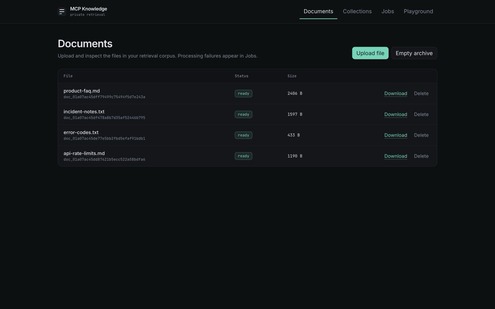
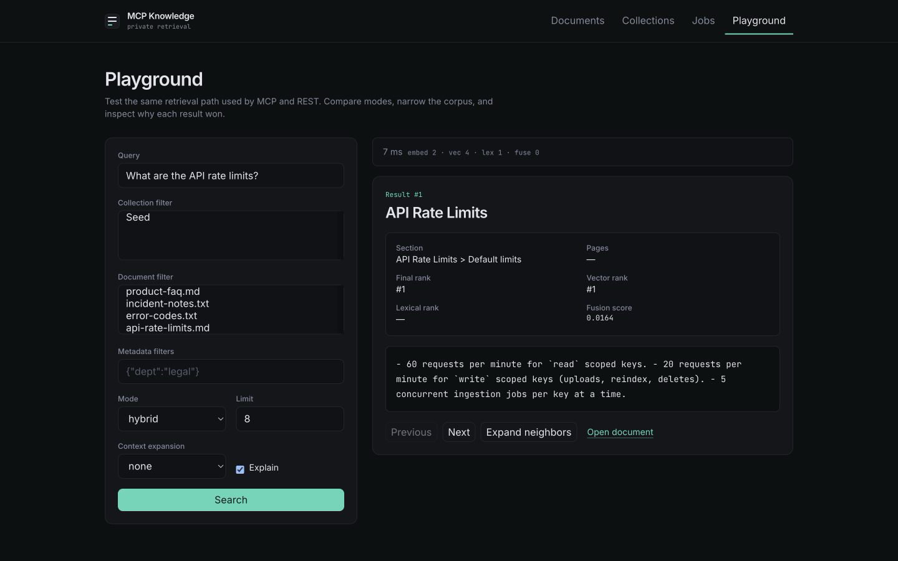
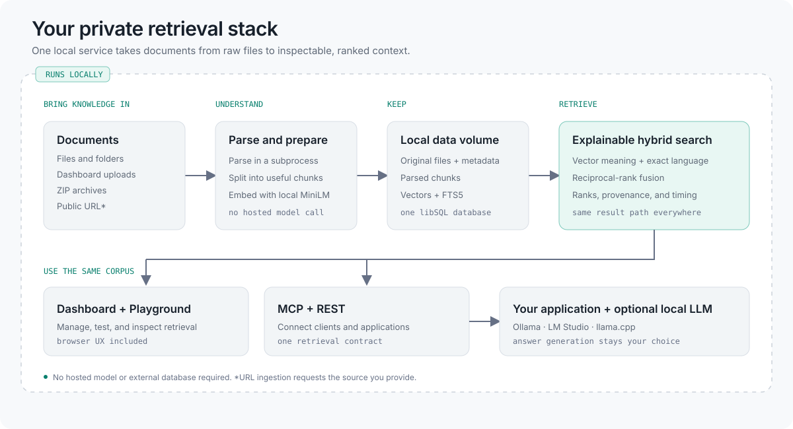
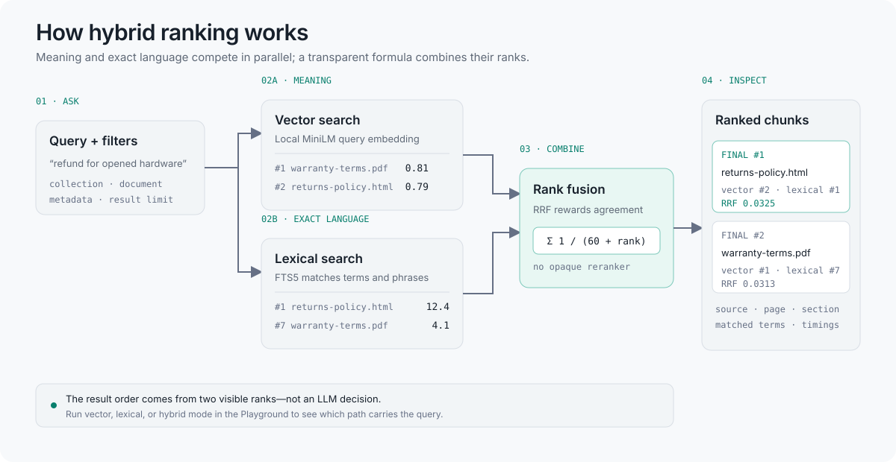

<div align="center">

# MCP Knowledge

**Private document retrieval with a built-in dashboard and explainable search playground — in one Docker container.**

Turn PDFs, Office files, Markdown, HTML, folders, URLs, and ZIP archives into a
searchable knowledge base. Manage it visually, prove retrieval quality on your
own corpus, then connect any MCP or REST client. Pair it with a local model
runtime for an end-to-end local RAG setup.

[**Run it now ↓**](#quick-start) ·
[Dashboard and playground](#dashboard-and-playground) ·
[Connect an MCP client](#connect-an-mcp-client) ·
[Local LLMs](#keep-the-whole-rag-path-local) ·
[Live overview](https://raysca.github.io/mcp-knowledge/) ·
[Documentation](#documentation)

[](https://github.com/raysca/mcp-knowledge/actions/workflows/docker.yml)
[](https://github.com/raysca/mcp-knowledge/pkgs/container/mcp-knowledge)
[](docs/container-release.md)
[](LICENSE)

</div>

---

## Quick start

Run the published multi-architecture image. Docker creates the named data
volume automatically:

```bash
docker run -d \
  --name mcp-knowledge \
  --restart unless-stopped \
  -p 127.0.0.1:3000:3000 \
  -v mcp-knowledge-data:/app/data \
  ghcr.io/raysca/mcp-knowledge:0.1
```

Wait for the service, then open [http://127.0.0.1:3000](http://127.0.0.1:3000):

```bash
docker inspect --format '{{.State.Health.Status}}' mcp-knowledge
curl --fail http://127.0.0.1:3000/health
```

The `0.1` tag follows the current v0.1 release line. To select this release
explicitly, use the versioned `0.1.0` tag instead.

By default the service is bound to loopback and has no authentication. That is
appropriate for a service only your machine can reach. Set a passphrase before
[exposing it to a LAN, proxy, or tunnel](#exposing-beyond-loopback).

Prefer Compose or want to build locally? A fresh clone follows `main` for
current development. To run the released v0.1.0 source instead:

```bash
git clone https://github.com/raysca/mcp-knowledge.git
cd mcp-knowledge
git checkout v0.1.0
docker compose up -d
```

## Dashboard and playground

The container includes a complete browser workspace at
[http://127.0.0.1:3000](http://127.0.0.1:3000). You do not need to learn the API
before you can build and evaluate a corpus.

| Surface | What it lets you do |
| --- | --- |
| **Documents** | Upload, download, delete, and reindex files; inspect document metadata and parsed chunks. |
| **Collections** | Organize the corpus and create narrower retrieval boundaries. |
| **Jobs** | Follow ingestion, directory scans, and ZIP imports; see actionable failures and retry jobs. |
| **Playground** | Search the same path used by MCP and REST, with collection, document, and metadata filters. |

<a href="assets/screenshots/dashboard.png">
  
</a>

<a href="assets/screenshots/playground.png">
  
</a>

The playground is more than a demo. Switch between hybrid, vector, and lexical
search; expand neighboring or section context; and inspect matched terms,
source locations, final/vector/lexical ranks, fusion scores, and per-stage
timing. This makes retrieval quality visible before an LLM is allowed to depend
on it.

A practical first run is:

1. Upload a file from **Documents** and watch it move to `ready`.
2. Open its detail view to inspect the parsed chunks and source metadata.
3. Query it in **Playground**, compare modes, and check why the best result won.
4. Connect an MCP client or application only after the retrieval behavior looks right.

## What it is for

- Build and operate a local knowledge base from a browser, without starting
  with API calls.
- Evaluate and debug retrieval against real documents before integrating an
  LLM.
- Give Claude, Cursor, and other MCP clients searchable access to private
  documents.
- Add a ready-made local retrieval layer to an application through REST.

This project provides retrieval, not answer generation. Your MCP client or
application decides how to use the returned passages.

## What you get

- **Local embeddings** — the MiniLM model is vendored and runs on your machine;
  no hosted model account is required.
- **Built-in dashboard** — manage documents and collections, inspect chunks,
  and monitor or retry ingestion from the browser.
- **Explainable playground** — compare retrieval modes, filter the corpus,
  expand context, and inspect ranks, provenance, matched terms, and timing.
- **MCP and REST together** — the same corpus and retrieval behavior proven in
  the playground, exposed on one port.
- **Explainable hybrid search** — every result can include its vector rank,
  lexical rank, and reciprocal-rank-fusion score.
- **Flexible ingestion** — upload files and ZIP archives, watch a local folder,
  or ingest an allowed public URL.
- **Common document formats** — PDF, Word, PowerPoint, Excel, HTML, Markdown,
  text, and more through [AnyDoc](https://github.com/firecrawl/anydoc).
- **Simple local operations** — one Bun process, one container, one persistent
  named volume, plus documented backup and recovery.

Images are published for `linux/amd64` and `linux/arm64`. Reference runs cover
100, 500, and 1,000 small documents; these are measurements, not hard capacity
limits or guarantees. See [the performance notes](docs/performance.md).

## Connect an MCP client

The Streamable HTTP endpoint is:

```text
http://127.0.0.1:3000/mcp
```

For an unauthenticated loopback-only instance, the client configuration is:

```json
{
  "mcpServers": {
    "knowledge": {
      "url": "http://127.0.0.1:3000/mcp"
    }
  }
}
```

The MCP surface is intentionally read-only:

- `search_documents`
- `get_document`
- `get_chunk`
- `list_documents`
- `list_collections`

Use the dashboard or REST API to upload and manage documents.

`get_document` returns the existing document metadata plus a `body` string
containing a complete JSON normalized document. The body is capped by
`MAX_MCP_DOCUMENT_CHARS` (default `32000`) and contains whole blocks only. A
small document fits in one response. For a larger document, pass the returned
`nextBlockCursor` as `block_cursor` until no cursor remains:

```json
{
  "name": "get_document",
  "arguments": {
    "document_id": "doc_...",
    "block_cursor": "cursor-from-previous-response",
    "block_limit": 50,
    "headings": ["Core Product"]
  }
}
```

`block_cursor`, `block_limit`, and `headings` are optional. `block_limit` is
bounded by `MAX_LIST_LIMIT` when supplied. Without it, each page includes as
many whole blocks as fit within the character ceiling. `headings` selects
complete sections by heading name before paging. Repeat the same `headings`
on each continuation request. Each response includes `truncated`,
`returnedBlocks`, and `totalBlocks`. Parse `body` on each page and append its
`blocks` in order. A block or document envelope that cannot fit within the
character ceiling returns `DOCUMENT_BLOCK_TOO_LARGE`. A cursor for another
document, revision, or heading selection returns `CURSOR_STALE`; a malformed
or changed cursor returns `INVALID_CURSOR`.

### Search context controls

`search_documents` accepts collection and document ID filters, structured
metadata filters, and bounded context expansion. For example, this request
filters to a collection and a metadata value, then includes one neighboring
chunk on each side of every match:

```json
{
  "name": "search_documents",
  "arguments": {
    "query": "winter gloves",
    "collection_ids": ["collection_handbooks"],
    "filters": {"department": "outdoor"},
    "expand": {"type": "neighbors", "before": 1, "after": 1}
  }
}
```

MCP expansion supports `none`, `neighbors`, and `section`, with `before` and
`after` counts from 0 to 5. `expand.type: "document"` remains REST-only; MCP
rejects it because returning an entire document can produce an unexpectedly
large result. To retrieve context around a known chunk, call `get_chunk`:

```json
{
  "name": "get_chunk",
  "arguments": {"chunk_id": "chunk_abc123", "before": 1, "after": 2}
}
```

Invalid arguments and metadata filters return MCP tool errors (`isError: true`)
whose text retains stable public codes, such as `INVALID_TOOL_ARGUMENTS` and
`INVALID_FILTER`.

### Distinct-document search

MCP `search_documents` and REST `POST /api/v1/search` accept
`"collapse": "document"` when the caller wants to choose documents:

```json
{
  "name": "search_documents",
  "arguments": {
    "query": "um how do I correct the invoice VAT amount please",
    "collapse": "document",
    "limit": 8
  }
}
```

Omitting `collapse` (or setting it to `"none"`) retains chunk results.
Document mode groups the normal bounded candidate pools after chunk-level
ranking. Each document keeps its best chunk, with document ID breaking ties.
REST hits expose the document rank as `ranking.finalRank` and preserve the
best chunk's pre-collapse position as `ranking.chunkRank`. When available,
vector/lexical ranks and scores and the fusion score remain in REST's
`ranking` object and describe the selected chunk.

MCP `search_documents` hits expose the document rank as the flat `rank` field
and the best chunk's pre-collapse position as the flat `chunkRank` field.
MCP does not expose the nested `ranking` object or its vector/lexical ranks,
scores, or fusion score.

Both APIs include `matchingChunkCount`, which counts that document's fused
candidates, and `matchedHeadings`, which lists their unique
headings. These summaries describe retrieved candidates, not all matches in
the corpus. A document-dominated candidate pool may return fewer than `limit`
distinct documents; there are no unbounded follow-up searches.

Lexical retrieval first requires every original query token (`AND`). If that
pass leaves candidate slots, a second pass drops a small static English
stop-word set and matches eligible terms with `OR`. Three or more distinct
eligible terms require at least two matches; two terms require at least one.
Fewer than two eligible terms never enter fallback, so a standalone SKU-like
identifier keeps all-terms matching. Exact-pass hits stay ahead of fallback
hits in lexical rank; hybrid fusion also considers vector rank. Title,
heading path, and content use FTS5 BM25 weights of 8, 4, and 1 respectively.
Fallback failures preserve available exact/vector results. This is retrieval,
not a guarantee that a returned document answers the question.

These additions are currently unreleased. Consumers should feature-detect
`collapse` in MCP `tools/list`, enable document mode explicitly, observe
traces, and retain chunk behavior against older images. Record the deployed
image digest so retrieval changes can roll back independently. The default
remains chunk mode; changing it is reserved for a major version.

If authentication is enabled, include a generated API key:

```json
{
  "mcpServers": {
    "knowledge": {
      "url": "http://127.0.0.1:3000/mcp",
      "headers": {
        "Authorization": "Bearer <secret>"
      }
    }
  }
}
```

### Generate an API key

API keys authenticate MCP clients and scripts. They are separate from the
dashboard passphrase and browser session. Once a passphrase is set, minting a
key requires an active dashboard session or an existing `admin` key:

```bash
curl -sS -X POST http://127.0.0.1:3000/api/v1/api-keys \
  -H 'content-type: application/json' \
  -b 'mk_session=<value from the dashboard login response>' \
  -d '{"name":"local","scopes":["admin"]}'
```

The response shows the `key_…` secret once; only its hash is stored. Omit
`scopes` to create a read-only key. Allowed scopes are `read`, `write`, and
`admin`.

## Keep the whole RAG path local

MCP Knowledge handles retrieval, not answer generation. That separation lets
you choose the inference layer without moving the corpus. Use an MCP-capable
local application backed by Ollama, LM Studio, llama.cpp, or another local
model runtime; alternatively, call the REST API from an application you
control.

<picture>
  <source media="(prefers-color-scheme: dark)" srcset="assets/diagrams/private-retrieval-stack-dark.svg">
  <source media="(prefers-color-scheme: light)" srcset="assets/diagrams/private-retrieval-stack-light.svg">
  
</picture>

When each component runs on the same device and binds to loopback, document
content does not need to leave the machine. This is an available deployment
property, not a blanket guarantee: URL ingestion makes outbound requests, and
remote models, plugins, or telemetry configured in the chosen client create
their own privacy boundaries.

## Upload and search

Open the dashboard at [http://127.0.0.1:3000](http://127.0.0.1:3000), or use
REST directly:

```bash
curl -sS -X POST http://127.0.0.1:3000/api/v1/documents \
  -F "file=@/path/to/a/document.pdf"

curl -sS -X POST http://127.0.0.1:3000/api/v1/search \
  -H 'content-type: application/json' \
  -d '{"query":"a phrase from the document","mode":"hybrid","limit":8}'
```

Poll `GET /api/v1/documents/:id` or watch the Jobs page until the document is
`ready`. Upload a `.zip` to extract and index every supported file it contains.

See [supported formats and limits](docs/supported-formats.md) before importing
large or unusual files.

## How it works

<picture>
  <source media="(prefers-color-scheme: dark)" srcset="assets/diagrams/hybrid-ranking-dark.svg">
  <source media="(prefers-color-scheme: light)" srcset="assets/diagrams/hybrid-ranking-light.svg">
  
</picture>

Parsing runs in a subprocess and embedding runs in a worker thread, isolating
the HTTP server from malformed documents and model work. Document originals,
normalized text, chunks, and indexes remain in the local data volume.

Vector and lexical candidates run in parallel. Reciprocal-rank fusion combines
their positions into the final order without an opaque reranker; the Playground
shows both source ranks, the fusion score, provenance, matched terms, and timing.

## Import a local directory

With Compose, mount a directory read-only and configure the startup scan:

```yaml
services:
  knowledge:
    environment:
      INGEST_DATA_DIR: /import
    volumes:
      - mcp-knowledge-data:/app/data
      - ./knowledge:/import:ro
```

`INGEST_DATA_MAX_DEPTH` defaults to `8`, and `INGEST_DATA_MAX_FILES` defaults
to `10000`. Missing source files do not delete indexed documents; changed or
renamed scanner-owned files replace their previous document.

URL ingestion is available through `POST /api/v1/documents/from-url`.
Loopback, private, link-local, and cloud-metadata targets are blocked,
including through redirects.

### Add metadata during a directory scan

Put `.mcp-knowledge-manifest.json` at the root of `INGEST_DATA_DIR`. Only that
root manifest is loaded; files with the same name anywhere in the tree are
excluded from ingestion. For example:

```json
{
  "rules": [
    { "glob": "guides/**/*.md", "metadata": { "documentType": "guide", "audience": "general" } },
    { "glob": "guides/safety/*.md", "metadata": { "audience": "specialist" } }
  ]
}
```

Rules match paths relative to the scan root, in order. Matching metadata
objects are merged shallowly, so the later rule overrides `audience` for
matching safety guides. The safe glob subset allows relative, forward-slash
paths with `*`, `**`, and `?`; absolute paths, `.`/`..` segments, and
brace, bracket, or extglob expansion are rejected. The manifest must be a
regular UTF-8 JSON file no larger than 1 MiB, with only a `rules` array;
each rule contains only `glob` and `metadata`. Invalid manifests fail the
startup scan before files are ingested.

Restart the service after adding or changing the manifest. A scan compares
manifest bytes as well as file content: changing matching metadata replaces
the scanner-owned document with a new document ID, even when its file bytes
are unchanged. The scanner always sets `sourcePath` to the actual relative
file path, including after a rename; a manifest cannot override it. Manifest
metadata is stored for direct scanner-owned document imports. It does not
assign metadata to individual members extracted from a scanned ZIP.

### List the document catalog

`GET /api/v1/document-catalog` and the MCP `list_document_catalog` tool expose
the same lightweight catalog. They require the usual authentication when a
passphrase is configured; an API key with `read` scope is sufficient. The
default selects live `ready` documents and returns only `id`, `revisionId`,
`title`, `sourcePath`, and `metadata`. The allowed projection is fixed to those
five fields plus `status` and `updatedAt`; fields such as storage keys and
hashes cannot be requested. `status` accepts `pending`, `processing`, `ready`,
`failed`, or `deleted`. Selecting `deleted` retrieves soft-deleted documents, while
other statuses select live documents. `limit` defaults to 50 (or
`MAX_LIST_LIMIT` if lower) and cannot exceed `MAX_LIST_LIMIT`.

For REST, `fields` is a comma-separated list and `filters` is a JSON-encoded
query parameter. This example filters metadata, narrows to a collection, and
requests a fixed projection:

```bash
curl -sS -G 'http://127.0.0.1:3000/api/v1/document-catalog' \
  -H 'Authorization: Bearer <read-api-key>' \
  --data-urlencode 'collectionId=collection_guides' \
  --data-urlencode 'filters={"documentType":"guide","year":{"gte":2025}}' \
  --data-urlencode 'fields=id,title,sourcePath,metadata' \
  --data-urlencode 'limit=50'
```

Use the corresponding MCP tool arguments for the same request:

```json
{
  "name": "list_document_catalog",
  "arguments": {
    "collection_id": "collection_guides",
    "filters": { "documentType": "guide", "year": { "gte": 2025 } },
    "fields": ["id", "title", "sourcePath", "metadata"],
    "limit": 50
  }
}
```

Filter fields can be metadata keys or dotted paths. A scalar value means
equality; operator objects support `eq`, `neq`, `in`, `exists`, `gte`, and
`lte`. REST uses `collectionId` and `ifCorpusVersion`; MCP uses
`collection_id` and `if_corpus_version`. Both responses use `corpusVersion`,
`items`, and optional `nextCursor`, with the same camelCase item fields.

For a following page, send the returned cursor as REST `cursor=<nextCursor>`
or MCP `{ "name": "list_document_catalog", "arguments": { "cursor": "<nextCursor>" } }`,
along with the original query and projection parameters. For a later refresh
of the completed REST query above, use the same parameters and add
`ifCorpusVersion=generation:123` (replacing `123` with the saved generation).
For MCP, add `"if_corpus_version": "generation:123"` to the same arguments.

Follow `nextCursor` with the **same status, collection, filters, fields, and limit**
until it is absent. Do not send `ifCorpusVersion` or `if_corpus_version` while
paging: an equal version returns `{ "corpusVersion": "generation:…",
"unchanged": true }` without a page, even if a cursor was supplied. Catalog
pages are live reads rather than a frozen snapshot. Compare every page's
`corpusVersion` with the first page; if it changes, discard the collected
pages and restart from the first page.

After finishing a query, save its `corpusVersion`. On a later refresh of that
**same completed query and projection**, send `ifCorpusVersion` (REST) or
`if_corpus_version` (MCP) with the saved version. An unchanged corpus returns
only `corpusVersion` and `unchanged: true`; a changed corpus returns the first
page, which you can continue without a conditional parameter. Version changes
can reflect changes outside your filter, so compare the returned items. The
catalog version is separate from document-page cursors; server deployments
still need an independent `DOCUMENT_CURSOR_SECRET` as described in
[Exposing beyond loopback](#exposing-beyond-loopback).

## Exposing beyond loopback

Set `DASHBOARD_PASSPHRASE` before publishing the service on a LAN, through a
reverse proxy, or through a tunnel. Generate an independent cursor secret with
`openssl rand -base64 32` and set `DOCUMENT_CURSOR_SECRET` to that value.
`APP_PROFILE=server` requires both values at startup. The cursor secret must
decode to exactly 32 bytes; keep the same secret for replacement containers
so document-page cursors remain valid. Local mode can omit it, in which case
cursors expire on restart.

```bash
export DOCUMENT_CURSOR_SECRET="$(openssl rand -base64 32)"
docker run -d \
  --name mcp-knowledge \
  --restart unless-stopped \
  -p 3000:3000 \
  -e DASHBOARD_PASSPHRASE='replace-with-a-long-random-passphrase' \
  -e DOCUMENT_CURSOR_SECRET \
  -v mcp-knowledge-data:/app/data \
  ghcr.io/raysca/mcp-knowledge:0.1
```

The dashboard sets an `HttpOnly`, `SameSite=Strict` session cookie after
login. Authentication does not trust network position: the same checks apply
through loopback, LAN access, and proxies. Read [SECURITY.md](SECURITY.md)
before exposing the service.

## Persistence, backup, and removal

Everything is stored in the `mcp-knowledge-data` volume. Replacing or
restarting the container preserves it:

```bash
docker restart mcp-knowledge
docker rm -f mcp-knowledge              # keeps the named volume
docker volume rm mcp-knowledge-data     # deletes all data — irreversible
```

For stopped-volume backup and disaster recovery, follow
[docs/backup-and-restore.md](docs/backup-and-restore.md). Document originals
are the irreplaceable part; normalized text, chunks, and embeddings can be
rebuilt.

## Choose MCP Knowledge when

- Your documents need to remain on hardware you control.
- You want retrieval over MCP without assembling a general RAG framework.
- REST and MCP should expose the same local corpus.
- You want ranking evidence rather than an unexplained similarity score.

It is not a chatbot, agent framework, general document-management system,
multi-tenant SaaS, or distributed vector database. Those boundaries are
deliberate for the `v0.1` release.

## Documentation

- [Supported formats](docs/supported-formats.md) — accepted file types, OCR and
  password behavior, size limits, and resource limits.
- [Troubleshooting](docs/troubleshooting.md) — ingestion failure codes, causes,
  and recovery steps.
- [Backup and restore](docs/backup-and-restore.md) — offline backup and disaster
  recovery.
- [Performance](docs/performance.md) — reference measurements for 100, 500,
  and 1,000 documents.
- [Container release](docs/container-release.md) — multi-architecture build,
  smoke testing, and publication.
- [Security model](SECURITY.md) — authentication, SSRF boundaries, backup
  sensitivity, and vulnerability reporting.
- [Changelog](CHANGELOG.md) — release contents and deliberately deferred scope.

## Develop without Docker

Requires [Bun](https://bun.sh/):

```bash
bun install
bun db:migrate
bun dev
```

Before committing:

```bash
bun run typecheck
bun test
```

`bun run release:check` runs the release gate: type checking, tests, CSS build,
Compose validation, both-platform Docker smoke, and scale-report validation.

### Retrieval regression evaluation

Run `bun test tests/retrieval/recall.test.ts` to ingest the 15 compact generic
fixtures into a fresh temporary database and print JSON reports. The original
22-query chunk-mode regression and its committed floors remain in place.
The additional `magic-voice-queries.json` set contains 18 invented,
anonymized, production-shaped utterances: filler-heavy project questions,
confusable runbooks and invoices, exact identifier queries, and no-answer
speech. All labels are grounded in existing fixtures. Invoice, returns, and
expense codes stand in for SKU/model-shaped identifiers; there is no real
product catalog, customer audio, or production query log in this evaluation.

Both hybrid and lexical runs request `collapse: "document"`, `limit: 10`,
check unique document IDs and structural provenance, and score 14 answerable
queries. Recall@5/@10 is the per-query fraction of relevant distinct
documents retrieved, averaged across queries; MRR uses the first relevant
distinct-document rank. Duplicate IDs cannot inflate recall or consume rank.
Two queries require both invoice documents, exercising partial recall.

The no-answer policy is deliberately strict: **any returned document is a
false positive**, with no score cutoff or downstream answer-generation step.
The four no-answer cases include unrelated requests and questions that share
words with a fixture but ask for facts it does not contain. Hybrid retrieval
has no abstention threshold and returned hits for all four (100% false-positive
rate); lexical retrieval returned hits for the two related cases (50%). The
lexical regression ceiling is 50%; hybrid false positives are reported as a
known limitation, not claimed as an abstention gate. The existing
`noAnswer.retrievalRate` remains available alongside `falsePositiveRate` and
the explicit policy name.

Three fresh-corpus runs established recall@5, recall@10, and MRR floors of
1.0 for both modes; measurements are recorded in
`tests/retrieval/evaluation-runs.json`. Reports preserve `latencyMs.p50` and
`latencyMs.p95` (nearest-rank percentiles of query HTTP timings after ingestion).
Latency is reported, not gated against machine-specific millisecond limits.
This small fixture suite is regression evidence only: it does not establish
production ASR accuracy, catalog-scale retrieval quality, or safe abstention.

## License

[MIT](LICENSE) © Raymond Ottun
