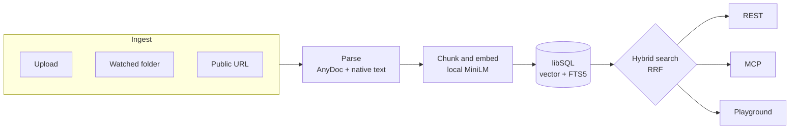

<div align="center">

# MCP Knowledge

**Private, self-hosted document retrieval for local RAG and MCP — in one Docker container.**

Turn PDFs, Office files, Markdown, HTML, folders, URLs, and ZIP archives into a
searchable knowledge base. Connect Claude, Cursor, or any Streamable HTTP MCP
client. Embeddings run locally with no hosted model or paid API key.

[**Run it now ↓**](#quick-start) ·
[Connect an MCP client](#connect-an-mcp-client) ·
[Live overview](https://raysca.github.io/mcp-knowledge/) ·
[Documentation](#documentation)

[](https://github.com/raysca/mcp-knowledge/actions/workflows/docker.yml)
[](https://github.com/raysca/mcp-knowledge/pkgs/container/mcp-knowledge)
[](docs/container-release.md)
[](LICENSE)

</div>

---

## Quick start

Run the published multi-architecture image. Docker creates the named data
volume automatically:

```bash
docker run -d \
  --name mcp-knowledge \
  --restart unless-stopped \
  -p 127.0.0.1:3000:3000 \
  -v mcp-knowledge-data:/app/data \
  ghcr.io/raysca/mcp-knowledge:main
```

Wait for the service, then open [http://127.0.0.1:3000](http://127.0.0.1:3000):

```bash
docker inspect --format '{{.State.Health.Status}}' mcp-knowledge
curl --fail http://127.0.0.1:3000/health
```

The `main` tag is the current published build. Pin a versioned tag such as
`0.1.0` when the first release is published.

By default the service is bound to loopback and has no authentication. That is
appropriate for a service only your machine can reach. Set a passphrase before
[exposing it to a LAN, proxy, or tunnel](#exposing-beyond-loopback).

Prefer Compose or want to build locally?

```bash
git clone https://github.com/raysca/mcp-knowledge.git
cd mcp-knowledge
docker compose up -d
```

## What it is for

- Give Claude, Cursor, and other MCP clients searchable access to private
  documents.
- Add a ready-made local retrieval layer to an application through REST.
- Inspect hybrid, vector, and lexical ranking without sending document content
  to a hosted embedding service.

This project provides retrieval, not answer generation. Your MCP client or
application decides how to use the returned passages.

## What you get

- **Local embeddings** — the MiniLM model is vendored and runs on your machine;
  no hosted model account is required.
- **MCP and REST together** — one service, one indexed corpus, one port.
- **Explainable hybrid search** — every result can include its vector rank,
  lexical rank, and reciprocal-rank-fusion score.
- **Built-in playground** — compare hybrid, vector, and lexical results at
  `/playground` before integrating a client.
- **Flexible ingestion** — upload files and ZIP archives, watch a local folder,
  or ingest an allowed public URL.
- **Common document formats** — PDF, Word, PowerPoint, Excel, HTML, Markdown,
  text, and more through [AnyDoc](https://github.com/firecrawl/anydoc).
- **Simple local operations** — one Bun process, one container, one persistent
  named volume, plus documented backup and recovery.

Images are published for `linux/amd64` and `linux/arm64`. Reference runs cover
100, 500, and 1,000 small documents; these are measurements, not hard capacity
limits or guarantees. See [the performance notes](docs/performance.md).

## Connect an MCP client

The Streamable HTTP endpoint is:

```text
http://127.0.0.1:3000/mcp
```

For an unauthenticated loopback-only instance, the client configuration is:

```json
{
  "mcpServers": {
    "knowledge": {
      "url": "http://127.0.0.1:3000/mcp"
    }
  }
}
```

The MCP surface is intentionally read-only:

- `search_documents`
- `get_document`
- `get_chunk`
- `list_documents`
- `list_collections`

Use the dashboard or REST API to upload and manage documents.

If authentication is enabled, include a generated API key:

```json
{
  "mcpServers": {
    "knowledge": {
      "url": "http://127.0.0.1:3000/mcp",
      "headers": {
        "Authorization": "Bearer <secret>"
      }
    }
  }
}
```

### Generate an API key

API keys authenticate MCP clients and scripts. They are separate from the
dashboard passphrase and browser session. Once a passphrase is set, minting a
key requires an active dashboard session or an existing `admin` key:

```bash
curl -sS -X POST http://127.0.0.1:3000/api/v1/api-keys \
  -H 'content-type: application/json' \
  -b 'mk_session=<value from the dashboard login response>' \
  -d '{"name":"local","scopes":["admin"]}'
```

The response shows the `key_…` secret once; only its hash is stored. Omit
`scopes` to create a read-only key. Allowed scopes are `read`, `write`, and
`admin`.

## Upload and search

Open the dashboard at [http://127.0.0.1:3000](http://127.0.0.1:3000), or use
REST directly:

```bash
curl -sS -X POST http://127.0.0.1:3000/api/v1/documents \
  -F "file=@/path/to/a/document.pdf"

curl -sS -X POST http://127.0.0.1:3000/api/v1/search \
  -H 'content-type: application/json' \
  -d '{"query":"a phrase from the document","mode":"hybrid","limit":8}'
```

Poll `GET /api/v1/documents/:id` or watch the Jobs page until the document is
`ready`. Upload a `.zip` to extract and index every supported file it contains.

See [supported formats and limits](docs/supported-formats.md) before importing
large or unusual files.

## How it works



Parsing runs in a subprocess and embedding runs in a worker thread, isolating
the HTTP server from malformed documents and model work. Document originals,
normalized text, chunks, and indexes remain in the local data volume.

## Import a local directory

With Compose, mount a directory read-only and configure the startup scan:

```yaml
services:
  knowledge:
    environment:
      INGEST_DATA_DIR: /import
    volumes:
      - mcp-knowledge-data:/app/data
      - ./knowledge:/import:ro
```

`INGEST_DATA_MAX_DEPTH` defaults to `8`, and `INGEST_DATA_MAX_FILES` defaults
to `10000`. Missing source files do not delete indexed documents; changed or
renamed scanner-owned files replace their previous document.

URL ingestion is available through `POST /api/v1/documents/from-url`.
Loopback, private, link-local, and cloud-metadata targets are blocked,
including through redirects.

## Exposing beyond loopback

Set `DASHBOARD_PASSPHRASE` before publishing the service on a LAN, through a
reverse proxy, or through a tunnel:

```bash
docker run -d \
  --name mcp-knowledge \
  --restart unless-stopped \
  -p 3000:3000 \
  -e DASHBOARD_PASSPHRASE='replace-with-a-long-random-passphrase' \
  -v mcp-knowledge-data:/app/data \
  ghcr.io/raysca/mcp-knowledge:main
```

The dashboard sets an `HttpOnly`, `SameSite=Strict` session cookie after
login. Authentication does not trust network position: the same checks apply
through loopback, LAN access, and proxies. Read [SECURITY.md](SECURITY.md)
before exposing the service.

## Persistence, backup, and removal

Everything is stored in the `mcp-knowledge-data` volume. Replacing or
restarting the container preserves it:

```bash
docker restart mcp-knowledge
docker rm -f mcp-knowledge              # keeps the named volume
docker volume rm mcp-knowledge-data     # deletes all data — irreversible
```

For stopped-volume backup and disaster recovery, follow
[docs/backup-and-restore.md](docs/backup-and-restore.md). Document originals
are the irreplaceable part; normalized text, chunks, and embeddings can be
rebuilt.

## Choose MCP Knowledge when

- Your documents need to remain on hardware you control.
- You want retrieval over MCP without assembling a general RAG framework.
- REST and MCP should expose the same local corpus.
- You want ranking evidence rather than an unexplained similarity score.

It is not a chatbot, agent framework, general document-management system,
multi-tenant SaaS, or distributed vector database. Those boundaries are
deliberate for the `v0.1` release.

## Documentation

- [Supported formats](docs/supported-formats.md) — accepted file types, OCR and
  password behavior, size limits, and resource limits.
- [Troubleshooting](docs/troubleshooting.md) — ingestion failure codes, causes,
  and recovery steps.
- [Backup and restore](docs/backup-and-restore.md) — offline backup and disaster
  recovery.
- [Performance](docs/performance.md) — reference measurements for 100, 500,
  and 1,000 documents.
- [Container release](docs/container-release.md) — multi-architecture build,
  smoke testing, and publication.
- [Security model](SECURITY.md) — authentication, SSRF boundaries, backup
  sensitivity, and vulnerability reporting.
- [Changelog](CHANGELOG.md) — release contents and deliberately deferred scope.

## Develop without Docker

Requires [Bun](https://bun.sh/):

```bash
bun install
bun db:migrate
bun dev
```

Before committing:

```bash
bun run typecheck
bun test
```

`bun run release:check` runs the release gate: type checking, tests, CSS build,
Compose validation, both-platform Docker smoke, and scale-report validation.

## License

[MIT](LICENSE) © Raymond Ottun
