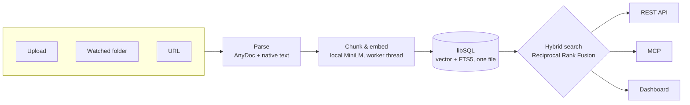

<div align="center">

# Document Knowledge

**Self-hosted document search over MCP and REST — built on Bun.**

Point it at your docs. Search them locally with explainable hybrid
retrieval, or plug straight into Claude, Cursor, or any MCP client.

🔑 No API key · ⚡ One Bun process · 🔍 Built-in search playground · 📦 Bulk `.zip` ingestion

[**Live overview →**](https://raysca.github.io/mcp-knowledge/) ·
[Quick start](#quick-start) ·
[MCP setup](#mcp) ·
[Docs](#supporting-docs)

[](LICENSE)
[](https://github.com/raysca/mcp-knowledge/actions/workflows/docker.yml)


</div>

---

## What you get

- **No API key, ever** — embeddings run locally on a vendored model.
- **Built on Bun** — one process, one container, fast cold start.
- **Search playground built in** — compare hybrid/vector/lexical results live at `/playground`.
- **Bulk ingestion** — drop a folder or a `.zip`; every file inside gets parsed and indexed.
- **Explainable ranking** — every hit ships its vector rank, lexical rank, and fusion score.
- **MCP-native** — a Streamable HTTP endpoint sits next to REST, same origin, same port.
- **Any format** — PDF, Word, PowerPoint, Excel, HTML, Markdown, and more via [AnyDoc](https://github.com/firecrawl/anydoc).

## Why not just use X?

|  | **Document Knowledge** | Hosted RAG APIs | LangChain / LlamaIndex | Self-hosted chat-with-docs |
| --- | :---: | :---: | :---: | :---: |
| Paid LLM API key | **No** | Yes | Usually | Usually |
| MCP-native | **Yes** | No | DIY | Rare |
| Explainable ranking | **Yes** | No | DIY | Rare |
| One container | **Yes** | N/A | No | Rarely |
| Data stays on your machine | **Yes** | No | Depends | Usually |

Hosted APIs win on demo speed; LangChain/LlamaIndex win on flexibility. This
wins when you want the retrieval service already built, on your own
hardware, nothing to sign up for.

## How it works



A subprocess parses, a worker thread embeds — a bad upload can't take the
server down, and nothing here calls out to a hosted model.

Not sure this is what you're looking for? See [What this is not](#what-this-is-not).

## Contents

- [What you get](#what-you-get)
- [Why not just use X?](#why-not-just-use-x)
- [How it works](#how-it-works)
- [Prerequisite](#prerequisite)
- [Quick start](#quick-start)
- [First upload and search](#first-upload-and-search)
- [MCP](#mcp)
- [Exposing beyond loopback](#exposing-beyond-loopback)
- [Import a local directory on startup](#import-a-local-directory-on-startup)
- [Persistence, recovery, and removal](#persistence-recovery-and-removal)
- [What this is not](#what-this-is-not)
- [Supporting docs](#supporting-docs)
- [Contributor workflow](#contributor-workflow-local-checkout-no-docker)

## Prerequisite

Docker Engine or Docker Desktop with Compose. Nothing else needs to be
installed on the host — Bun, the parser, and the embedding model are all
inside the image.

## Quick start

```bash
docker compose up -d
```

This builds the image, starts one container bound to `127.0.0.1:3000`, and
creates a named volume (`mcp-knowledge-data`) that holds everything —
database, document originals, embeddings. Wait for it to report healthy:

```bash
docker compose ps
curl --fail http://127.0.0.1:3000/health
```

With no `DASHBOARD_PASSPHRASE` set, the instance has no auth at all — the
dashboard, REST API, and MCP endpoint all just work on loopback. That's fine
for a service only your own machine can reach; see
[Exposing beyond loopback](#exposing-beyond-loopback) before putting this
anywhere else can reach it.

## First upload and search

Open `http://127.0.0.1:3000` for the dashboard, or use the API directly:

```bash
curl -sS -X POST http://127.0.0.1:3000/api/v1/documents \
  -F "file=@/path/to/a/document.pdf"

curl -sS -X POST http://127.0.0.1:3000/api/v1/search \
  -H 'content-type: application/json' \
  -d '{"query":"a phrase from the document","mode":"hybrid","limit":8}'
```

Poll `GET /api/v1/documents/:id` or watch the Jobs page until it reaches
`ready`.

- **Playground:** `/playground` runs hybrid, vector, and lexical search side
  by side and shows why each result ranked where it did.
- **Bulk ingest:** upload a `.zip` instead of one file and every allowlisted
  file inside it gets extracted and indexed.

See [docs/supported-formats.md](docs/supported-formats.md) for accepted file
types and size limits.

## MCP

Dashboard, REST, and MCP share the same `Bun.serve()` process and port — the
MCP endpoint is `/mcp` (Streamable HTTP). MCP tools are read-only
(`search_documents`, `get_document`, `get_chunk`, `list_documents`,
`list_collections`); use the REST API to upload or manage documents.

```json
{
  "mcpServers": {
    "knowledge": {
      "url": "http://127.0.0.1:3000/mcp",
      "headers": {
        "Authorization": "Bearer <secret>"
      }
    }
  }
}
```

If no `DASHBOARD_PASSPHRASE` is set, omit the `Authorization` header entirely.

### Generate an API key

API keys are for MCP clients and scripts — separate from the dashboard's
passphrase/session. Once a passphrase is set, minting a key requires either
an active dashboard session or an existing `admin` key:

```bash
curl -sS -X POST http://127.0.0.1:3000/api/v1/api-keys \
  -H 'content-type: application/json' \
  -b 'mk_session=<value from the dashboard login response>' \
  -d '{"name":"local","scopes":["admin"]}'
```

The response includes `secret` once (a `key_…` string); only a hash is
stored afterward. Omit `scopes` to get `read`. Allowed scopes: `read`,
`write`, `admin`.

```bash
curl -sS http://127.0.0.1:3000/api/v1/documents \
  -H "Authorization: Bearer <secret>"
```

Empty the corpus: `POST /api/v1/documents/purge` with `{ "confirm": "purge" }`.
Collections and API keys stay.

## Exposing beyond loopback

**Set `DASHBOARD_PASSPHRASE` before making this reachable from anywhere but
`127.0.0.1`** — a LAN address, a reverse proxy, a tunnel:

```bash
DASHBOARD_PASSPHRASE=correct-horse-battery-staple docker compose up -d
```

Opening the dashboard now prompts for the passphrase. On success the server
sets an `HttpOnly`, `SameSite=Strict` session cookie (`mk_session`, 30 days).
Logging in also unlocks `/api/v1/*` for that browser session, so you can mint
your first API key from the dashboard itself. Wrong-passphrase attempts are
rate-limited per remote address.

There is no network-position exception anywhere in auth — a passphrase is
checked the same way regardless of who's asking or how they connect, which is
what makes it safe to put a real reverse proxy in front. See
[SECURITY.md](SECURITY.md) for the full model, including URL-ingest SSRF
protections and backup sensitivity.

## Import a local directory on startup

Set `INGEST_DATA_DIR` to scan one local directory in the background after the
server starts:

```yaml
# compose.yaml
environment:
  INGEST_DATA_DIR: /import
volumes:
  - ./knowledge:/import:ro
```

`INGEST_DATA_MAX_DEPTH` defaults to `8` (`0` means root files only) and
`INGEST_DATA_MAX_FILES` defaults to `10000`. Missing files do not remove
documents; changed and renamed scanner-owned files replace the prior
document. A `.zip` found by the scan is extracted the same way a manually
uploaded one is. Progress appears on the Jobs page. URL ingest works the same
way on demand: `POST /api/v1/documents/from-url` with `{ "url": "https://..." }`
(loopback, RFC1918, link-local, and cloud-metadata targets are blocked,
including through redirects).

## Persistence, recovery, and removal

Everything lives in the `mcp-knowledge-data` volume. Restarting or rebuilding
the container preserves it:

```bash
docker compose restart
docker compose down      # keeps the volume
docker compose down -v   # deletes it — irreversible
```

For an offline backup or disaster recovery onto a fresh volume, see
[docs/backup-and-restore.md](docs/backup-and-restore.md). Every derived
artifact (normalized text, chunks, embeddings) can be rebuilt from the stored
original via reindex; the original itself is what backup and restore protect.

## What this is not

Not a chat app, not an agent framework, not a general document-management
system. No hosted AI dependency, no multi-tenancy, no distributed deployment
in v0.1 — see [CHANGELOG.md](CHANGELOG.md) for the full list of what's
deliberately out of scope for this release.

## Supporting docs

- [docs/supported-formats.md](docs/supported-formats.md) — accepted file
  types, OCR/password behavior, size and resource limits.
- [docs/troubleshooting.md](docs/troubleshooting.md) — every ingestion
  failure code, what it means, and how to recover.
- [docs/backup-and-restore.md](docs/backup-and-restore.md) — offline backup
  and disaster recovery.
- [docs/performance.md](docs/performance.md) — reference scale measurements
  at 100/500/1,000 documents.
- [docs/container-release.md](docs/container-release.md) — how the
  multi-architecture image is built, tested, and published.
- [SECURITY.md](SECURITY.md) — exposure model, SSRF boundary, and how to
  report a vulnerability.
- [CHANGELOG.md](CHANGELOG.md) — what's in 0.1.0 and what's deliberately not.

## Contributor workflow (local checkout, no Docker)

```bash
bun install
bun db:migrate
bun dev
```

Dashboard, REST, and MCP share one `Bun.serve()` process (default
`http://127.0.0.1:3000`). Before committing:

```bash
bun run typecheck
bun test
```

`bun run release:check` runs the full release gate (typecheck, tests, CSS
build, Compose validation, both-platform Docker smoke, scale-report
validation) — the same gate `v0.1.0` was tagged against.

## License

[MIT](LICENSE) © Raymond Ottun
